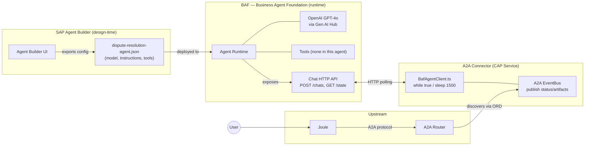

# BAF / Agent Builder Architecture

```mermaid
graph LR
    subgraph "SAP Agent Builder (design-time)"
        AB[Agent Builder UI] -->|exports config| Config["dispute-resolution-agent.json<br/>(model, instructions, tools)"]
    end

    subgraph "BAF — Business Agent Foundation (runtime)"
        Config -->|deployed to| Runtime[Agent Runtime]
        Runtime --- LLM[OpenAI GPT-4o<br/>via Gen AI Hub]
        Runtime --- Tools["Tools (none in this agent)"]
        Runtime -->|exposes| API[Chat HTTP API<br/>POST /chats, GET /state]
    end

    subgraph "A2A Connector (CAP Service)"
        API <-->|HTTP polling| BAC[BafAgentClient.ts<br/>while true / sleep 1500]
        BAC --- EventBus[A2A EventBus<br/>publish status/artifacts]
    end

    subgraph "Upstream"
        Joule[Joule] -->|A2A protocol| Router[A2A Router]
        Router -->|discovers via ORD| EventBus
    end

    User((User)) --> Joule
```
